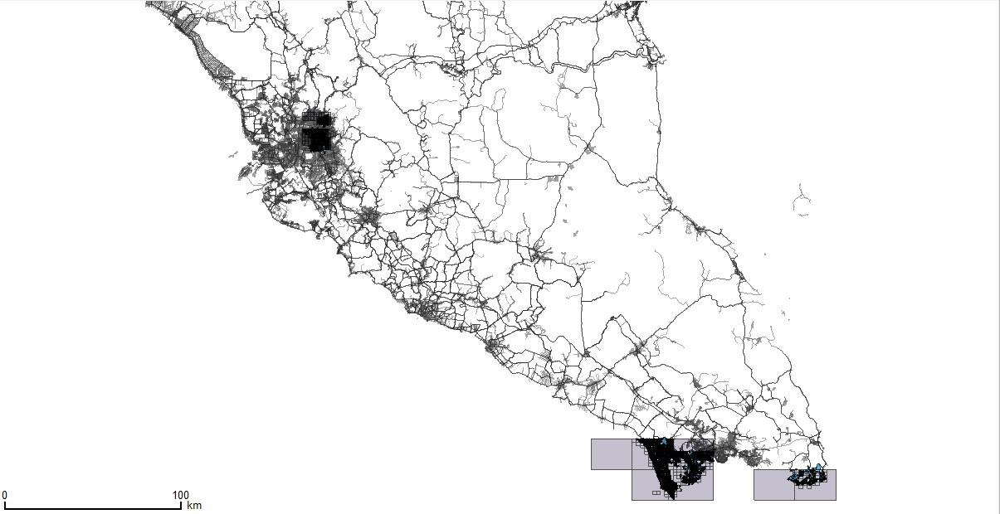
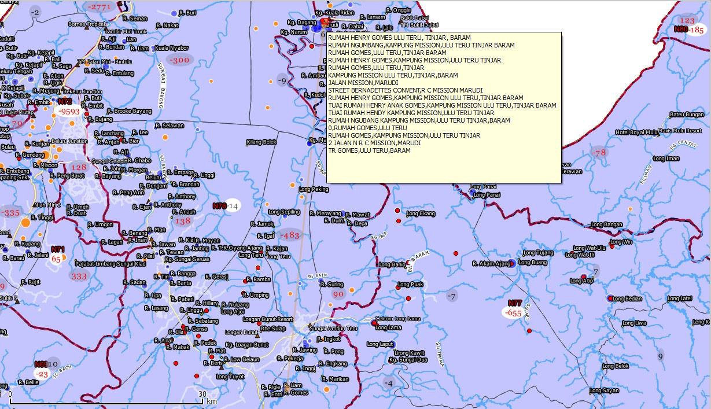
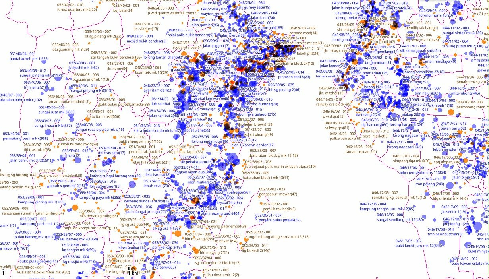

# Spiders & Crawlers

Some tools I wrote to help automate some tasks. A number of these are crawlers that are built using [scrapy](https://scrapy.org/).

## pos_spider.py

This just crawls and graps the postcode off POS Malaysia's site. These postcodes are useful for a number of things. For example as bounding boxes,

## ec_spider.py

For the longest time, the page provided by the ELection Commision to verify your voter registration details had conviniently shown your name, polling station, and your registered voting address. A CAPTCHA was also used to make sure it was a human requesting this info. Unfortunately, this CAPTCHA was just 3 text letters resized, coloured and transformed using CSS.

This script excarcebated the above design errors. On the bright side, these errors did lead to a better understanding of the Election Commission and was a new fountain of knowledge. The addresses of voters helped greatly in the correct identification of the geographical location of various voting localities, This helped greatly in rural areas in Sarawak where voting localities are named after these longhouses. Interestingly, these longhouses tend to get a name change when the village headman is replaced.

It also allowed some degree of automation in the geolocation of voters and voting localities.

